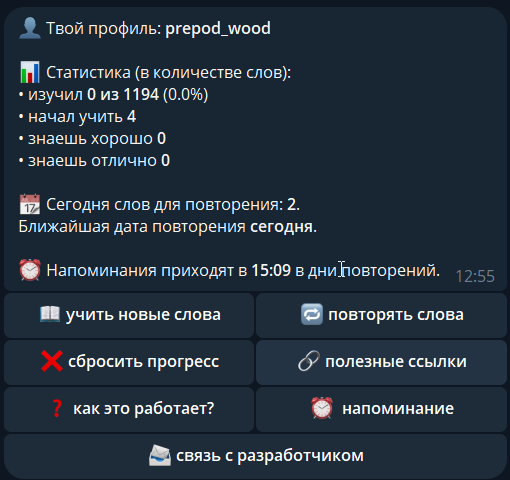
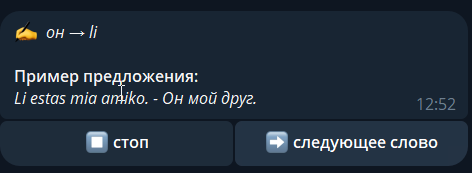
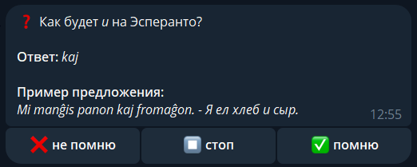

# 📋 Описание

Telegram-бот для изучения слов на языке Эсперанто с помощью интервального повторения. 

# 🚀 Запуск

Для того, чтобы начать учить слова, перейдите по [ссылке](https://t.me/instruisto_bot) и начните общаться с ботом

# 📸 Скриншоты

# 🤗 Благодарности
— Список слов взят из подборки слов Владимира К. (ник incredibletroth) на сайте Quizlet (https://quizlet.com/incredibletroth/sets).
— Примеры предложений сконструированы ChatGPT.
— Корректировщики-эсперантисты: Сергей Кумков (https://vk.com/sskumkov) , Tatjana (https://t.me/legado_eo_ru), Aleksei Samsonov
— Аватарка бота сгенерирована Midjourney
— Спасибо всем, кто участвовал в тестировании!
